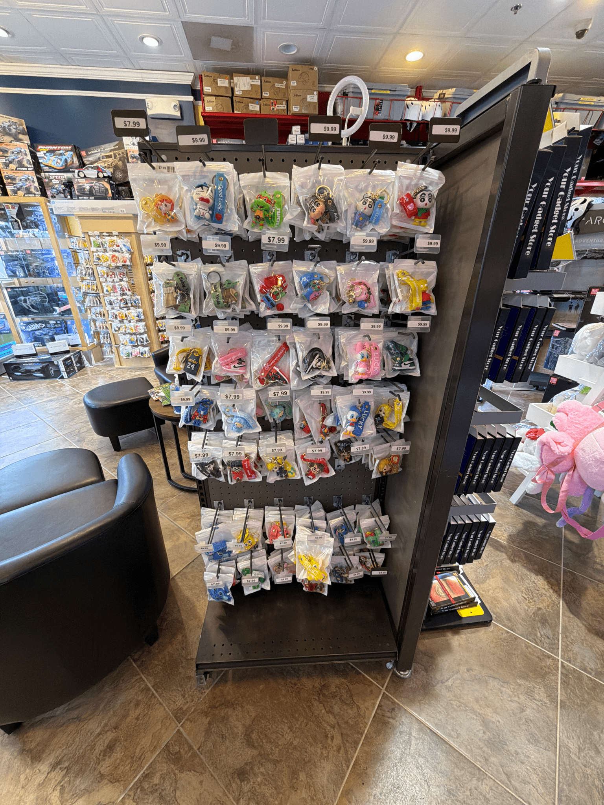
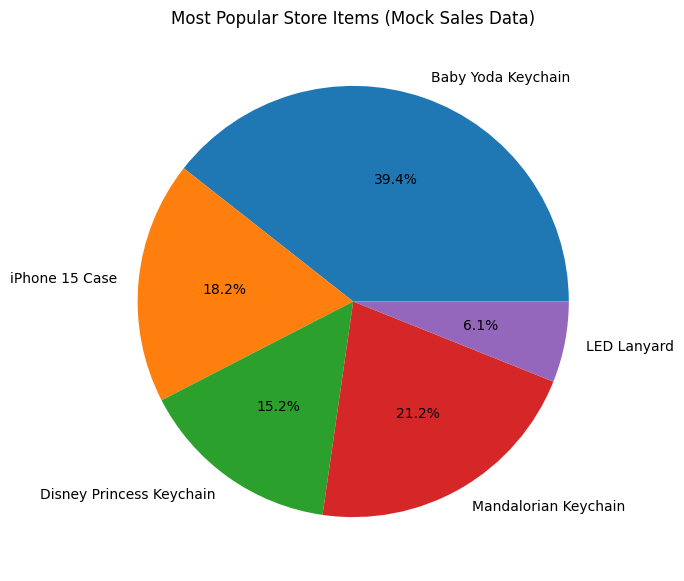
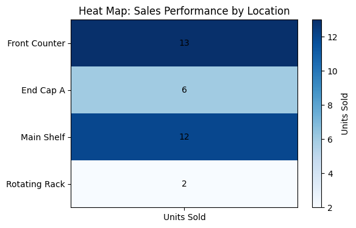
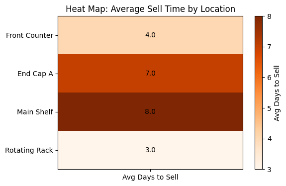

# **Modeling a Mobile Repair Retail Store in Software**

## Keychain Fixture



Multi-Dimensional Array Version:

| Title            | Column 1 | Column 2 | Column 3 | Column 4 | Column 5 | Column 6 | Row total |
|------------------|----------|----------|----------|----------|----------|----------|-----------|
| **Row 1**        | 5        | 5        | 4        | 5        | 5        | 5        | 29        |
| **Row 2**        | 5        | 6        | 5        | 5        | 5        | 6        | 32        |
| **Row 3**        | 4        | 4        | 4        | 7        | 7        | 7        | 33        |
| **Row 4**        | 3        | 6        | 2        | 5        | 5        | 5        | 26        |
| **Row 5**        | 5        | 5        | 5        | 5        | 2        | 5        | 27        |
| **Row 6**        | 4        | 5        | 3        | 8        | 3        | 5        | 28        |
| **Row 7**        | 6        | 5        | 3        | 6        | 4        | 4        | 28        |
| **Column Total** | 32       | 36       | 26       | 41       | 31       | 37       | 203       |

Object-Oriented Version:


```python
# ============================================
# 1. Imports & Dataclasses
# ============================================
from dataclasses import dataclass, field
from typing import List
from datetime import datetime, timedelta
import matplotlib.pyplot as plt
import uuid
import statistics
import random
import numpy as np
import pandas as pd

# ============================================
# 2. Core Data Models
# ============================================
@dataclass
class ShelfTracking:
    date_received: datetime
    date_displayed: datetime

@dataclass
class Transaction:
    transaction_id: str
    storeitem_name: str
    location: str
    quantity_change: int
    timestamp: datetime
    transaction_type: str

@dataclass
class StoreItem:
    name: str
    upc: str
    quantity: int
    category: str
    location: str
    shelf_tracking: ShelfTracking
    transactions: List[Transaction] = field(default_factory=list)
    _sold_durations: List[int] = field(default_factory=list)

    def _record_transaction(self, qty_change: int, transaction_type: str):
        txn = Transaction(
            transaction_id=str(uuid.uuid4()),
            storeitem_name=self.name,
            location=self.location,
            quantity_change=qty_change,
            timestamp=datetime.now(),
            transaction_type=transaction_type,
        )
        self.transactions.append(txn)
        return txn

    def purchase(self, qty: int = 1):
        if qty > self.quantity:
            raise ValueError("Not enough inventory to complete purchase.")
        sell_date = datetime.now()
        display_date = self.shelf_tracking.date_displayed
        days_on_shelf = max(0, (sell_date - display_date).days)
        for _ in range(qty):
            self._sold_durations.append(days_on_shelf)
        self.quantity -= qty
        return self._record_transaction(-qty, "purchase")

    def return_item(self, qty: int = 1):
        self.quantity += qty
        return self._record_transaction(qty, "return")

    def replenish(self, qty: int):
        self.quantity += qty
        return self._record_transaction(qty, "replenish")

    @property
    def average_days_to_sell(self):
        return statistics.mean(self._sold_durations) if self._sold_durations else 0

# ============================================
# 3. Store Structure (Store -> Fixture -> Location -> FixtureCell -> StoreItem)
# ============================================
@dataclass
class FixtureCell:
    row: int
    column: int
    items: List[StoreItem]

@dataclass
class DisplayLocation:
    name: str
    fixture_cells: List[FixtureCell]

@dataclass
class Fixture:
    name: str
    locations: List[DisplayLocation]

@dataclass
class Store:
    name: str
    fixtures: List[Fixture]

# ============================================
# 4. Generate Mock Store with Items & Randomized Shelf Times
# ============================================
def random_shelf_tracking(max_days_on_shelf: int = 
"""
Generates randomized shelf tracking timestamps:
  - Items were received between 8–12 days ago
  - Items were displayed 1–days_received days ago (ensures no impossible dates)
"""
    days_received = random.randint(8, 12)
    days_displayed = random.randint(1, days_received)
    date_received = datetime.now() - timedelta(days=days_received)
    date_displayed = datetime.now() - timedelta(days=days_displayed)
    return ShelfTracking(
        date_received=date_received,
        date_displayed=date_displayed
    )

# Mock items with randomized display times
item1 = StoreItem("Baby Yoda Keychain", "57023", 20, "Keychain", "Front Counter", random_shelf_tracking())
item2 = StoreItem("iPhone 15 Case", "88002", 20, "Accessory", "End Cap A", random_shelf_tracking())
item3 = StoreItem("Disney Princess Keychain", "99011", 20, "Keychain", "Main Shelf", random_shelf_tracking())
item4 = StoreItem("Mandalorian Keychain", "57089", 20, "Keychain", "Main Shelf", random_shelf_tracking())
item5 = StoreItem("LED Lanyard", "44022", 20, "Accessory", "Rotating Rack", random_shelf_tracking())

# ---------------------------------------------------------
# Simulate realistic random sales counts
# ---------------------------------------------------------
item1.purchase(random.randint(10, 15))
item2.purchase(random.randint(6, 10))
item3.purchase(random.randint(5, 9))
item4.purchase(random.randint(4, 8))
item5.purchase(random.randint(1, 5))

# Fixture mock
fixture = Fixture(
    name="Front Fixture",
    locations=[
        DisplayLocation(
            name="Front Counter",
            fixture_cells=[FixtureCell(1, 1, [item1])]
        ),
        DisplayLocation(
            name="Wall A",
            fixture_cells=[FixtureCell(1, 1, [item2, item3])]
        ),
        DisplayLocation(
            name="Main Shelf",
            fixture_cells=[FixtureCell(2, 1, [item4])]
        ),
        DisplayLocation(
            name="Rotating Rack",
            fixture_cells=[FixtureCell(3, 1, [item5])]
        )
    ]
)
store = Store(name="Demo Store", fixtures=[fixture])

# ============================================
# 5. Aggregate Sales for Visualization
# ============================================
all_items = [item1, item2, item3, item4, item5]
labels = [item.name for item in all_items]
sales = [
    sum(-txn.quantity_change for txn in item.transactions if txn.transaction_type == "purchase")
    for item in all_items
]

# ============================================
# 6. Pie Chart Visualization
# ============================================
plt.figure(figsize=(7,7))
plt.pie(sales, labels=labels, autopct='%1.1f%%')
plt.title("Most Popular Store Items (Mock Sales Data)")
plt.show()

# ============================================
# Heat Map of Location Performance
# ============================================

# Gather all store items (assuming these exist from earlier in the notebook)
all_items = [item1, item2, item3, item4, item5]

# --------------------------------------------
# 1. Aggregate sales by location
# --------------------------------------------
location_sales = {}
for item in all_items:
    units_sold = sum(-txn.quantity_change for txn in item.transactions if txn.transaction_type == "purchase")
    if item.location not in location_sales:
        location_sales[item.location] = 0
    location_sales[item.location] += units_sold

# Convert to DataFrame (heat maps work best with 2D matrices)
df_sales = pd.DataFrame.from_dict(location_sales, orient='index', columns=["Units Sold"])

# --------------------------------------------
# 2. Aggregate average days-to-sell by location
# --------------------------------------------
location_days = {}
for item in all_items:
    avg_days = item.average_days_to_sell
    if item.location not in location_days:
        location_days[item.location] = []
    location_days[item.location].append(avg_days)

# Average across all items in each location
location_avg_days = {
    loc: sum(days)/len(days) if days else 0
    for loc, days in location_days.items()
}
df_avg_days = pd.DataFrame.from_dict(location_avg_days, orient='index', columns=["Avg Days to Sell"])

# ============================================
# 3. Plot Heat Map - Units Sold
# ============================================
plt.figure(figsize=(6,4))

plt.imshow(df_sales, cmap="Blues", aspect="auto")
plt.colorbar(label="Units Sold")
plt.title("Heat Map: Sales Performance by Location")

# Label axes
plt.xticks([0], ["Units Sold"])
plt.yticks(range(len(df_sales.index)), df_sales.index)

# Display values inside cells
for (i, j), val in np.ndenumerate(df_sales.values):
    plt.text(j, i, f"{int(val)}", ha='center', va='center', color="black")
plt.show()

# ============================================
# 4. Plot Heat Map - Average Days to Sell
# ============================================
plt.figure(figsize=(6,4))

plt.imshow(df_avg_days, cmap="Oranges", aspect="auto")
plt.colorbar(label="Avg Days to Sell")
plt.title("Heat Map: Average Sell Time by Location")

# Label axes
plt.xticks([0], ["Avg Days to Sell"])
plt.yticks(range(len(df_avg_days.index)), df_avg_days.index)

# Display values inside cells
for (i, j), val in np.ndenumerate(df_avg_days.values):
    plt.text(j, i, f"{val:.1f}", ha='center', va='center', color="black")
plt.show()

```


    

    


    

    


    

    

